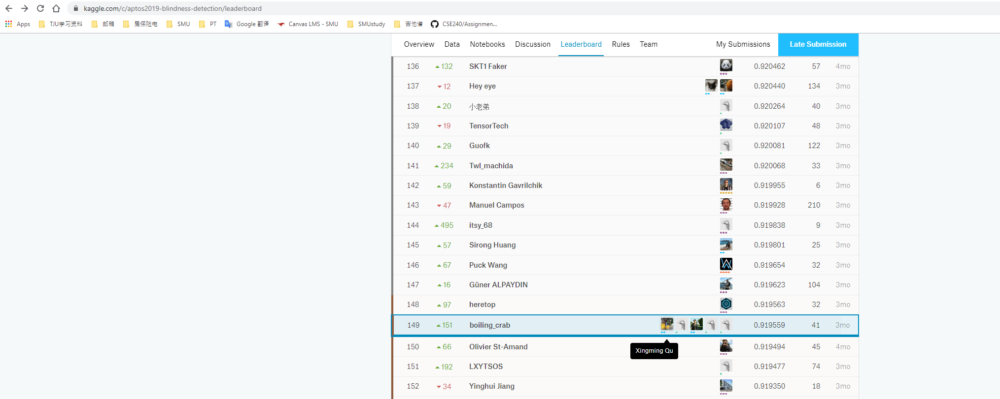

# Kaggle Competitions
### Xingming Qu

## APTOS 2019 Blindness Detection1
Detect diabetic retinopathy to stop blindness before it's too late
The goal was Building a machine learning model to identify diabetic retinopathy by 5 different severity.

In this competition, we had three major problems:
1.  Data set was not big, and it was highly imbalanced among different classes.
2.  How to design an effective way to pre-process the retina images.
3.  Find potential technics during model training and predicting to improve results.
In this competition  we were given around 3700 images, which were divided to 5 categories according to their severity. The worst thing as I mentioned before, was that the data was highly imbalanced. We had lots of benign images but less malignant images.  It made sense because lots of people did not have serious problem. 
One way to deal with lacking data is to use the pre-train model. Lucky, we had access to the APTOS 2015 Blindness Detection data set. So, I decided to use the previous dataset to pretrain the model. The previous data set was still highly imbalanced. So I used oversampling to the minority classes and undersampling to majority classes. Therefore, I made the pre-train data balanced.
The second problem was to deal with retina images. These images came with  different lighting conditions and different shapes. Also, images had black margin around the retina.  Therefore, we used high pass filtering to reduce lighting-condition effects and to make the edges become sharper. Also we only crop the retina area to get rid of the uninformed black margins.
Then we can start training. We used dense net 121  as our baseline model. I did try other models like Resnet50 or state-of-the-art efficient net. But it seems like dense net had the best performance in this task.
For the third problem, we applied lots of data augmentation like rotate, flip, blur, shear and crop during training. We also tried the Focal Loss and class weight to more attention to hard examples.
When testing I applied Test time argumentation, which gave me a little bit boost. Finally, I ensemble all the models trained with different parameters and average their prediction. I Achieved top 5% (149/2944) submission among all the teams. We were only 2 positions away from a silver medal.

